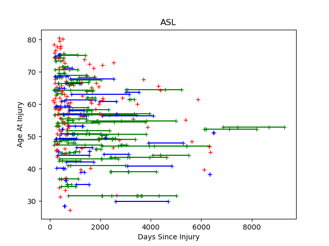
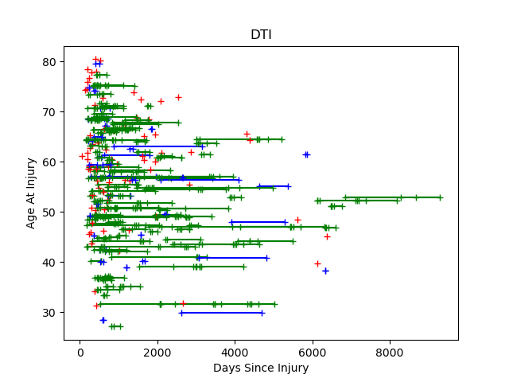
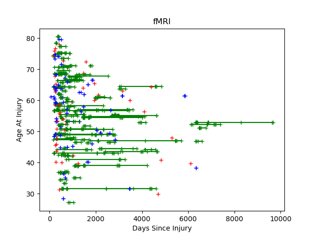
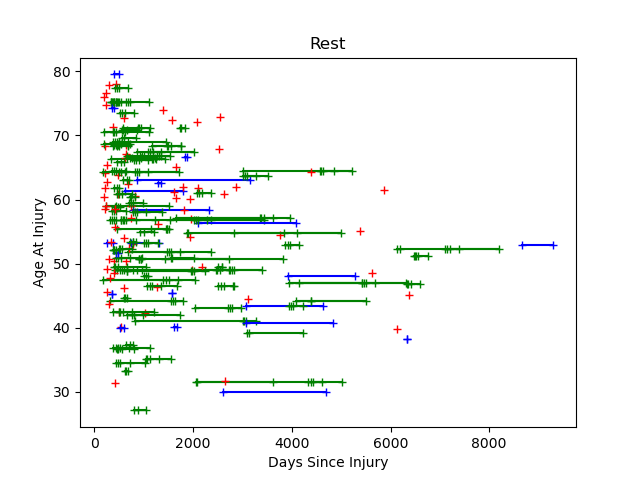
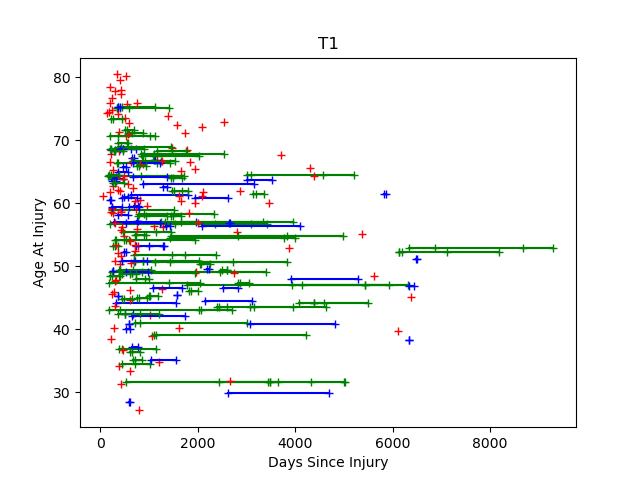
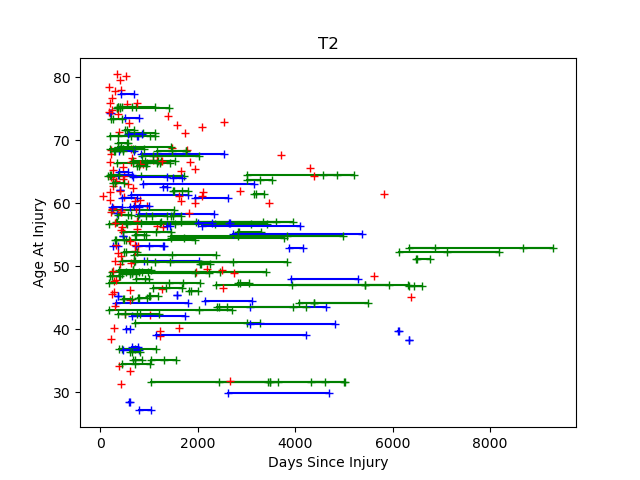

## About

The Aphasia Research Cohort (ARC) is a large group of people with aphasia who have participated in magentic resonance imaging (MRI) studies. These individuals have also been involved in a large number of assessments during their treatment. The combination of these imaging biomarkers and behavioral measures can help identify predictors for recovery. In addition, this dataset can provide insight into the crucial brain areas for human communication. The ARC is a retrospective archive combining data from many different research studies acquired since 2006. Some individuals were only seen once, while other individuals were seen over a period of years. Different individuals were involved in different treatment studies, so the behavioral assessments and imaging modalities vary across sessions. The role of the 
AphasiaResearchCohortQuery software (ARCquery) is to help users deal with this overwhelming variability. Each scientist can choose thier own preferred behevaioral measures and imaging biomarkers. 

##### Requirements

ARCquery is a Matlab script, so you must have Matlab installed.

##### Usage

When you run 'ARCquery' from Matlab, it will show you text display that shows all the individuals who match your criteria. You can type commands to modify your criteria. For example, in the example below the user has chosen to set an `a`ge criteria to restrict the analyses to people aged from 45 to 75 years old. You can filter on many criteria including behavioral scores. Once you are happy with your selection, press the `q` key to quit, and Excel files will be generated listing all the imaging data and behavioral scores that match the chosen criteria.

```
Participants: 193 Visits: 798 Scans: 4362
Criteria: AgeAtInjury:45..75 
 AgeAtInjury (n: 188) min: 45.1481 mean: 59.2819 max: 74.7996
 DaysPostInjury min: 0 max: 9685
 Gender (n: 193) Women: 67 Men 126
 12 Modalities: fMRI T1 ASL DTIrev Rest T2 fmap FLAIR fmapSErev angio RestRev Restrev
 17 Tasks: wab_aphasia_type wab_aq wab_comp_aud_words wab_comp_seq_comm wab_comp_subscore wab_comp_yesno wab_flu_rating wab_ic wab_nam_subscore wab_obj_naming wab_rep_subscore wab_resp_speech wab_sent_compl wab_spon_speech wab_word_flu wais_matrices wais_score
 106 Unique Notes
 Resolution: 0.4..3.5x0.4..3.5x0.4..7.5x0.0..10.0
 9 Studies: CT LIME R01 VAST LARC NE POLAR SE R21
 Voxels: 64..512x58..512x10..484x1..427
Commands
 a: age at injury
 d: days post injury
 g: gender
 l: longitudinal
 m: modality
 n: notes
 r: resolution
 s: study
 t: task
 v: voxels
 q: quit
Enter Command
```

##### Notes

This is a simple Matlab script, and you are free to modify it for more sophisticated searches.

##### Advanced Usage

This repository also includes the optional Matlab script `modality_count` that will find create a tab-delimited text file that shows number of scans for each indvidual for each scanning modality. For example, it will create a file named `T1.tab` that looks like this:

```
ID	AgeAtInjury	VisitDaysPostInjury
M2001	38.9 	1058
M2002	54.4 	4006	3770	1440
M2004	70.6 	524
M2005	31.5 	2446	5020	4996	4334	522	3476
```

This table reveals that participant M2002 was 54 years old at injury (though be aware a little random noise is added to this value for anonymity), and visited for T1 scans at three occasions, corresponding with 4006, 3770 and 1440 days post injury.

These .tab files can be converted to graphs using the `graph.py` function. It will create a bitmap graph for each scanning modality. The vertical axes shows age at injury, while the horizontal axes shows the days post injury for each scan. Individuals who were only scanned once are plotted in red, those who were scanned twice are shown in blue, and those scanned more than twice are shown in green.







 

